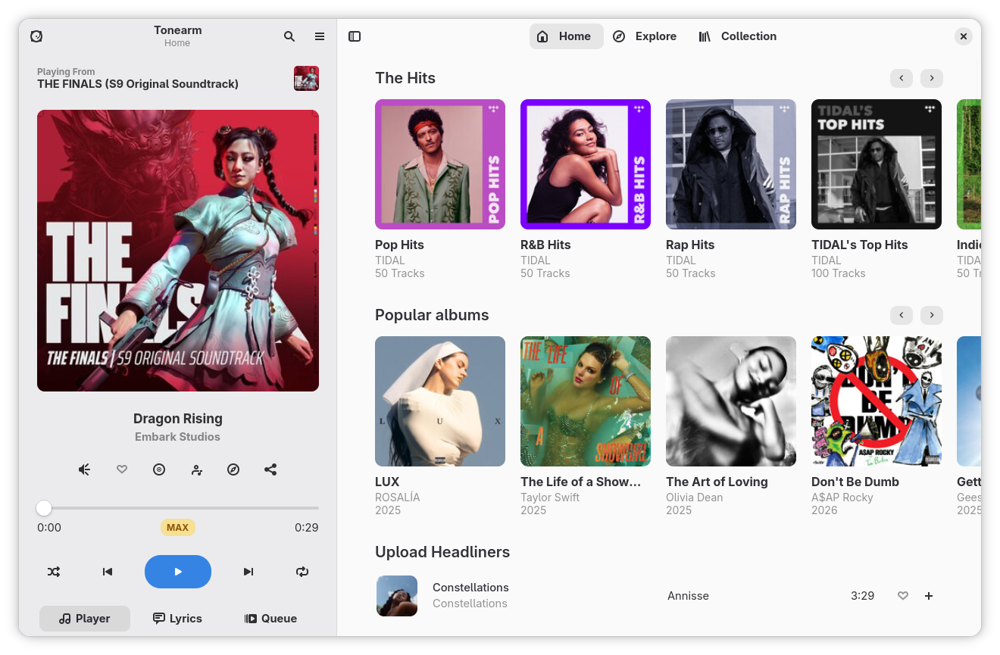
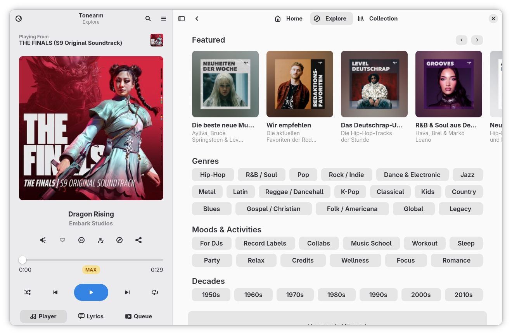

<div align="center">

  <a href="https://github.com/RayZ3R0/sonami-gtk">
    
  </a>
  <h2 align="center">Sonami</h2>

  [![Forks][forks-shield]][forks-url]
  [![Stargazers][stars-shield]][stars-url]
  [![Issues][issues-shield]][issues-url]
  [![License][license-shield]][license-url]

  <p align="center">
    Sonami is a <strong>native</strong> GTK4 / Adwaita music streaming client for <a href="https://tidal.com">TIDAL</a>.<br />
    <em>It is a fork of the excellent <a href="https://codeberg.org/dergs/Tonearm">Tonearm</a> project by dergs.</em>
    <br />
    <a href="#installation"><strong>How to Install »</strong></a>
    <br />
    <br />
    <a href="#features">Features</a>
    &middot;
    <a href="https://github.com/RayZ3R0/sonami-gtk/issues/new">Report Bug or Request Feature</a>
  </p>

  

</div>

## Disclaimer
Sonami is not affiliated with or endorsed by TIDAL. Sonami is provided as-is without any warranty or guarantees. We explicitly do not offer and are not planning to offer any kind of offline playback functionality, Sonami is not a downloader. A paid TIDAL account is required for full-length playback.

## Features
- Background Playback
  - Can be brought back to the front by MPRIS or by simply starting the app again
- Configurable through dconf
- Gapless Playback
- MPRIS playback information and player controls
- Position-aware Lyrics Viewer
  - Fallback to plain lyrics viewer if the song does not have timestamped lyrics
- Scrobbling to ListenBrainz-compatible servers
- Sign-in to your account via QR code / device linking code
  - Also works without signing in, with limited playback duration (Same as TIDAL web) 
- Supports playback of tracks in Max (AKA Master) quality
  - Currently, Sonami will always play at the highest available quality
- Works with "Open in TIDAL" links (E.g. [tidal://my-collection](tidal://my-collection))

## Installation
Currently the only tested installation method is the AUR package provided in the repository as well as the flatpak file and tarball included in the releases. If you want to package this software for another distro or marketplace, please do open an issue so we can coordinate.

### Arch Linux (AUR) 
You will require an AUR helper, such as yay or paru.

This assumes you are using the [yay helper](https://github.com/Jguer/yay). If using paru, adapt the commands accordingly.
```
yay -S sonami-gtk-bin
```

## Screenshots
<details>
  <summary>Explore Page</summary>
  
</details>

<details>
  <summary>Search + Lyrics</summary>
  
</details>

## Acknowledgements
The following projects and resources served as inspiration or were helpful during the development of Sonami.
- [Tonearm](https://codeberg.org/dergs/Tonearm) is the project this client was forked from, and Sonami owes almost all of its functionality to it.
- [High Tide](https://github.com/Nokse22/high-tide/) for the original design of the player in the sidebar
- [puregotk](https://codeberg.org/puregotk/puregotk) for making this project possible with only minimal CGO bindings
- [TIDAL](https://tidal.com/) for the overall page designs, which we adapted for GTK


[license-shield]: https://img.shields.io/github/license/RayZ3R0/sonami-gtk?style=for-the-badge
[license-url]: https://github.com/RayZ3R0/sonami-gtk/blob/main/LICENSE
[stars-shield]: https://img.shields.io/github/stars/RayZ3R0/sonami-gtk?style=for-the-badge
[stars-url]: https://github.com/RayZ3R0/sonami-gtk/stargazers
[forks-shield]: https://img.shields.io/github/forks/RayZ3R0/sonami-gtk?style=for-the-badge
[forks-url]: https://github.com/RayZ3R0/sonami-gtk/forks
[issues-shield]: https://img.shields.io/github/issues/RayZ3R0/sonami-gtk?style=for-the-badge
[issues-url]: https://github.com/RayZ3R0/sonami-gtk/issues
