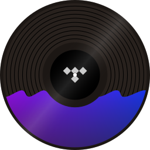
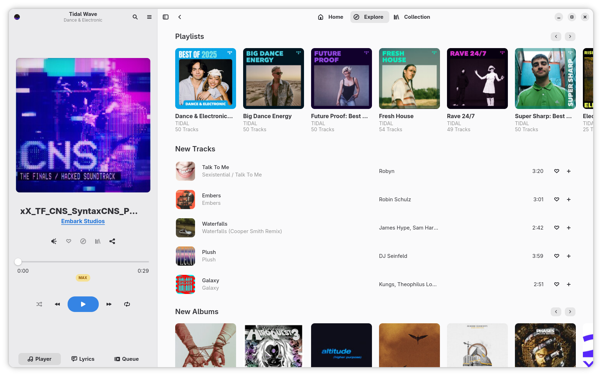
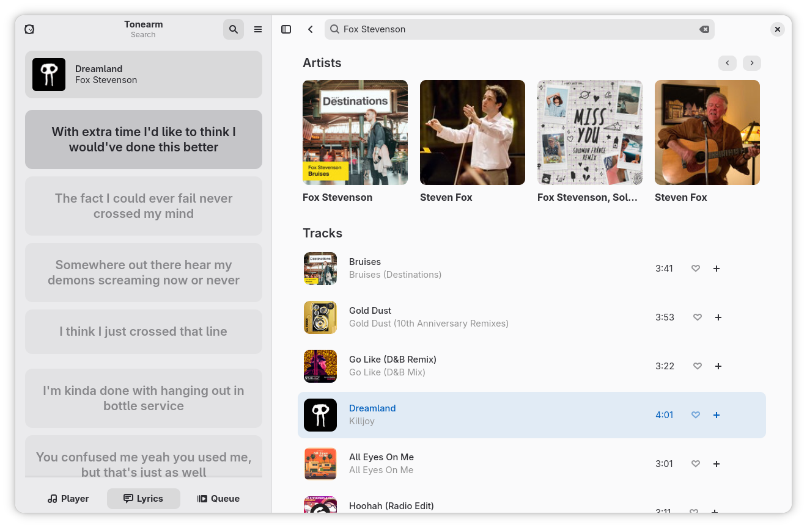

<div align="center">

  <a href="https://codeberg.org/dergs/Tonearm">
    
  </a>
  <h2 align="center">Tonearm</h2>

  [![Forks][forks-shield]][forks-url]
  [![Stargazers][stars-shield]][stars-url]
  [![Issues][issues-shield]][issues-url]
  [![License][license-shield]][license-url]

  <p align="center">
    Tonearm is an <strong>unofficial</strong> native GTK4 / Adwaita music streaming client for <a href="https://tidal.com">TIDAL</a>
    <br />
    <a href="#installation"><strong>How to Install »</strong></a>
    <br />
    <br />
    <a href="#features">Features</a>
    &middot;
    <a href="https://codeberg.org/dergs/Tonearm/issues/new">Report Bug or Request Feature</a>
  </p>

  

</div>

## Disclaimer
Tonearm is not affiliated with or endorsed by TIDAL. Tonearm is provided as-is without any warranty or guarantees. We explicitly do not offer and are not planning to offer any kind of offline playback functionality, Tonearm is not a downloader. A paid TIDAL account is required for full-length playback.

## Features
- Background Playback
  - Can be brought back to the front by MPRIS or by simply starting the app again
- Configurable through dconf
- Gapless Playback
- MPRIS playback information and player controls
- Position-aware Lyrics Viewer
  - Fallback to plain lyrics viewer if the song does not have timestamped lyrics
- Scrobbling to ListenBrainz
- Sign-in to your account via QR code / device linking code
  - Also works without signing in, with limited playback duration (Same as TIDAL web) 
- Supports playback of tracks in Max (AKA Master) quality
  - Currently, Tonearm will always play at the highest available quality
- Works with "Open in TIDAL" links (E.g. [tidal://my-collection](tidal://my-collection))

## About the Project
We set out to create a native, modern looking streaming client for TIDAL built with GTK4 and Libadwaita. We oriented a lot on existing GNOME apps (both official and third-party) to ensure the client really fits into the GNOME desktop and its applications, something web apps and electron apps often struggle with. We also try to keep the general spirit of TIDAL's UI so users can understand the app relatively quickly.

Tonearm came to existence as a learning project on how to implement GTK apps using GoLang, a rather unconventional choice. It was also an attempt at re-creating the look and feel of writing GUI applications in SwiftUI. This resulted in the development of the UI library [schwifty](https://codeberg.org/dergs/Tonearm/src/branch/main/pkg/schwifty) which may be extracted into its own repository at some point.

The current design for Tonearm originally came to be when I tried myself on a re-design of High Tide. This is why the sidebar features a very similar player layout. The rest of the application has largely been designed after common GNOME app practices and the TIDAL web interface.

## Installation
Currently the only tested installation method is the Nix flake provided in the repository. If you want to package this software for another distro or marketplace, please do open an issue so we can coordinate.

### NixOS (Flake)
This assumes that your system configuration is already done using a system flake. First add this repository as an input to your flake.
```nix
inputs = {

    nixpkgs.url = "github:NixOS/nixpkgs/nixpkgs-unstable";

    ... your other inputs ...

    tonearm = {
      url = "git+https://codeberg.org/dergs/Tonearm.git";
      inputs.nixpkgs.follows = "nixpkgs";
    };

}
```
then add this anywhere in your system configuration as you see fit
```nix
{ tonearm, ... }:

{

  # System Packages
  environment.systemPackages = [
    tonearm.packages.${pkgs.stdenv.hostPlatform.system}.tonearm
  ];

  # Or if you prefer via Home Manager
  home.packages = [
    tonearm.packages.${pkgs.stdenv.hostPlatform.system}.tonearm
  ];

}
```

### Arch Linux (AUR) 
For now, only the `-git` version is available, because the software doesn't have a release.

You will require an AUR helper, such as yay or paru.

This assumes you are using the [yay helper](https://github.com/Jguer/yay). If using paru, adapt the commands accordingly.
```
yay -S tonearm-git
```

## Screenshots
<details>
  <summary>Explore - Genre</summary>
  
</details>

<details>
  <summary>Search + Lyrics</summary>
  
</details>

## Acknowledgements
The following projects and resources served as inspiration or were helpful during the development of Tonearm.
- [High Tide](https://github.com/Nokse22/high-tide/) for the original design of the player in the sidebar
- [puregotk](https://github.com/jwijenbergh/puregotk) for making this project possible with only minimal CGO bindings
- [TIDAL](https://tidal.com/) for the overall page designs, which we adapted for GTK


[license-shield]: https://img.shields.io/badge/license-gpl3%20or%20later-brightgreen?style=for-the-badge
[license-url]: https://codeberg.org/dergs/Tonearm/src/branch/main/LICENSE
[stars-shield]: https://img.shields.io/gitea/stars/dergs/Tonearm?gitea_url=https%3A%2F%2Fcodeberg.org&style=for-the-badge
[stars-url]: https://codeberg.org/dergs/Tonearm/stars
[forks-shield]: https://img.shields.io/gitea/forks/dergs/Tonearm?gitea_url=https%3A%2F%2Fcodeberg.org&style=for-the-badge
[forks-url]: https://codeberg.org/dergs/Tonearm/forks
[issues-shield]: https://img.shields.io/gitea/issues/open/dergs/Tonearm?gitea_url=https%3A%2F%2Fcodeberg.org&style=for-the-badge
[issues-url]: https://codeberg.org/dergs/Tonearm/issues
